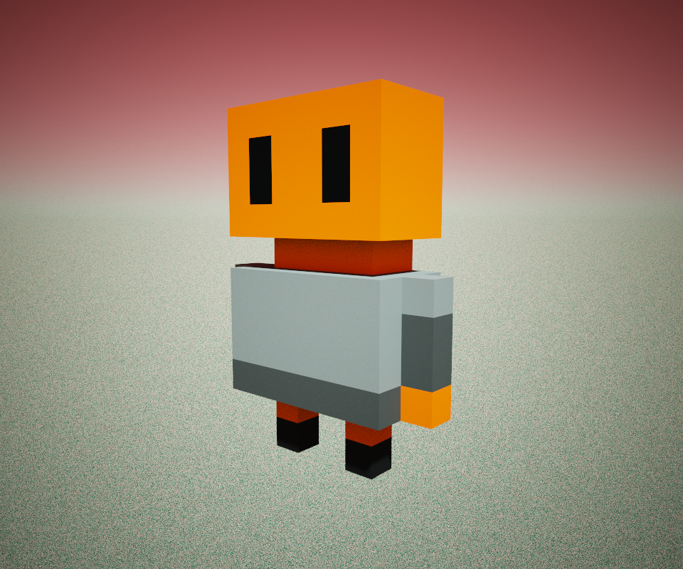
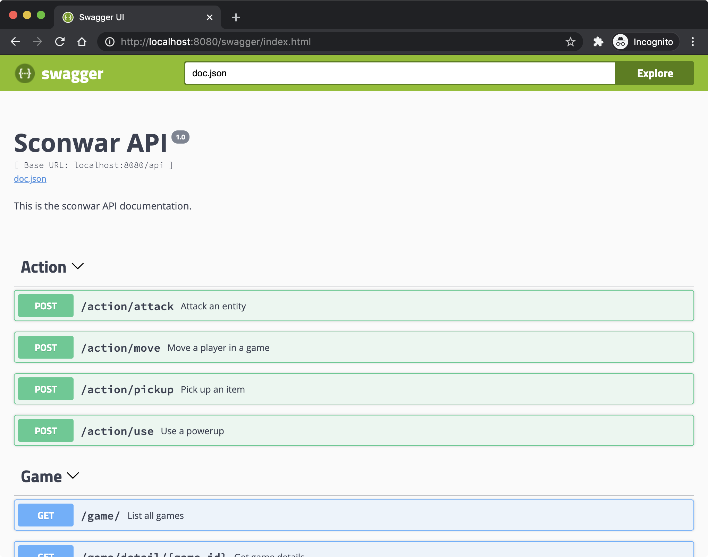

# 👾 sconwar - a bring your own client programming game

<p align="center">
  <a href="https://twitter.com/leonjza"></a>
  <a href="https://twitter.com/rc1140"></a>
  <a href="https://twitter.com/scoobymib3"></a>
</p>



`sconwar` is a "bring your own client" programming game where the only interface with the game is via a RESTful api. Some `sconwar` features are:

- Primary interface is via a RESTful API
- Turn-based game logic
- Written in Go, clients can be in any language

The game itself is pretty simple. A 20 by 20 sized board is spawned, populated by creep & power ups. Players join the board taking turns to battle it out in a last person standing war. Killing other creep players will award you points, with a multiplier that applies post-game based on your position.

Your goal is to write your own client to out-score your opponents and climb the leaderboard.

## installation

The game server can be compiled with:

```bash
make clean swagger-install deps swagger install
```

This will download dependencies and compile the `sconwar` executable.

If you prefer docker, simply run `make docker` and then run the built image with:

```bash
docker run --rm -it -p 8080:8080 -e API_TOKEN=foo sconwar:local
```

## how to play



The most important resource you need to know about the is the API documentation. Once the server is running you can find the documentation by browsing to it. Unless you have a custom hosting setup, you can find this at <http://localhost:8080/>.

### getting started overview

To start a `sconwar` game, you need two things:

- A `player_id`, obtainable by registering to the server. This ID is a secret, and you should treat it that way.
- A `game_id`, obtainable by starting a new game.

Depending on the server setup, an administrator could either share the key configured to setup new users, or you could ask for a player token.

### game flow

To actually play a game, a small dance needs to happen first. It's pretty simple. Create a game, join a game and then start the game. Once the game is running you can invoke Actions and Player endpoints to get an idea of your surroundings and decide what moves to make.

Starting a game will take the following calls:

- Make a POST request to `game/new` with a game name. Take note of the UUID value returned. This ID's your game.
- Make a POST request to `game/join` using your secret `player_id` and the newly obtained `game_id`.
- When all of the players have joined, make a PUT request to `game/start/{game-uuid}` to start the game.

This game & player id combination is used in all `action/*` endpoints to issue commands.

### game rules

Sconwar is a turned-based game. A game has both creep and players that could move, attack, decide to pick up a power up or do nothing. Creep decide what to do relatively quickly, but Players could take a little longer. For this reason, players have 30 seconds to invoke an action. While it is not your turn, you may queue up to two actions that will automatically get executed when its your turn again.

As for the game itself, there are a few rules. Those are:

- Players have two moves they can make per turn.
- Players can queue up up to two actions while it is not their turn.
- A turn lasts for a maximum of 30 seconds.
- The maximum distance you can move / attack / pick up something is two tiles.
- A Fog of War is applicable. That means that the surroundings endpoint won't show the entire board, unless the game is finished.
- Activating a power up does not consume a turn.

### game goal

Get the top score on the leaderboard! The meta/scores endpoint will return total scores, and the meta/leaderboard endpoint will show the top scoring games!

### sconwar tips

While playing sconwar:

- Check the player status endpoint to see which power ups you have, how much health you have left etc.
- Check the game info endpoint to see who's turn it is now.
- Check the surroundings endpoint as often as possible to see who and what is in range to plan your move.
- Use the meta/types endpoint as a reference for what some of the internal ID's such as power ups, statuses and other entities in Sconwar mean.

## license

`sconwar` is licensed under a [GNU General Public v3 License](https://www.gnu.org/licenses/gpl-3.0.en.html). Permissions beyond the scope of this license may be available at [http://sensepost.com/contact/](http://sensepost.com/contact/).

The sconwar logo is a derivative work of [Mini Mike's Metro Minis](https://github.com/mikelovesrobots/mmmm), and the license is available [here](https://github.com/mikelovesrobots/mmmm/blob/master/LICENSE).
